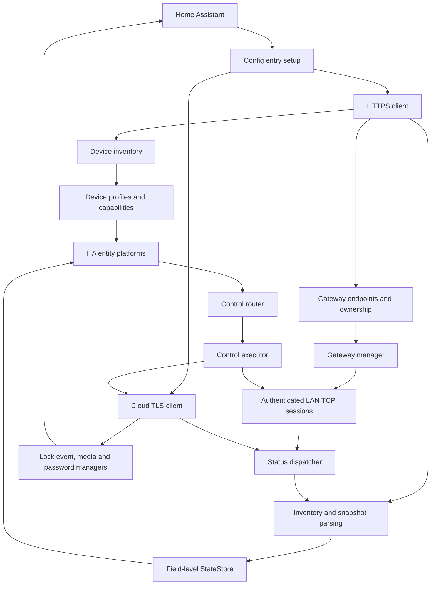

# ORVIBO Smart Control 运行时架构

本文描述 `orvibo-smart-control` 当前已经实现的结构、数据流和架构决策。行为以`custom_components/orvibo_smart_control/` 中的代码和自动化测试为准。

## 系统边界

项目同时面对三类外部系统：

| 边界              | 用途                                               | 是否可独立工作                         |
| ----------------- | -------------------------------------------------- | -------------------------------------- |
| Home Assistant    | 配置项、实体、服务、事件、媒体和生命周期           | 集成宿主                               |
| MixPad 局域网网关 | 支持设备的低延迟控制和实时推送                     | 只覆盖能力表中的 LAN 设备              |
| ORVIBO 云服务     | 登录、区域/家庭/设备库存、TLS 实时通道、门锁富功能 | 所有模式首次发现需要；运行期依模式使用 |

“LAN 优先”表示运行时动作优先选择本地通道，不表示安装和设备发现完全离线。没有云端
库存时，集成无法可靠建立账号、家庭、网关和设备之间的所有权关系。

仓库、集成域、服务域、媒体目录、卡片名称和实体唯一 ID 前缀均属于独立项目身份：

```text
repository   maycode0-0/orvibo-smart-control
HA domain    orvibo_smart_control
entry class  OrviboSmartControlConfigFlow
coordinator  OrviboSmartControlCoordinator
```

## 运行时拓扑



### 模块所有权

| 模块                               | 主要职责                                              | 不应承担的职责      |
| ---------------------------------- | ----------------------------------------------------- | ------------------- |
| `https_client.py`、`protocol.py`   | 云登录、readtable、原始记录归一化                     | 选择 LAN/云控制通道 |
| `device_types.py`                  | 从复合协议字段识别设备类别和验证状态                  | 网络 I/O            |
| `device_selection.py`              | 按实际名称和类型动态生成配置流设备分组并合并选择      | 改变设备能力        |
| `capabilities.py`                  | 类别对应平台、只读/云专属标记、控制通道               | 构造具体设备命令    |
| `device_inventory.py`              | 设备过滤、初始化和周期云快照合并                      | 实时连接管理        |
| `lan/`                             | 网关发现、认证、TCP 生命周期、请求关联和 payload 适配 | HA 实体语义         |
| `ssl_client.py`                    | 云端二进制 TLS 会话、推送和命令                       | LAN 可达性判断      |
| `status_dispatcher.py`、`parsers/` | ID 匹配和分类状态补丁                                 | 保持网络连接        |
| `state_store.py`                   | 字段级来源修订、保护窗口和去重                        | 协议字段推断        |
| `control_router.py`                | 把 HA 动作转为规范方法和参数                          | 选择传输实例        |
| `control_executor.py`              | 选择通道、执行、单次回退、乐观状态                    | 设备分类规则        |
| `lock_manager.py`                  | 门锁事件归一化、去重和开锁/开门关联                   | 媒体下载            |
| `lock_media_manager.py`            | 签名 URL、截图、录像、历史和清理                      | 门锁状态分类        |
| `temp_password_manager.py`         | 授权创建、撤销、查询和回收                            | 暴露持久密码实体    |
| `coordinator.py`                   | 组合以上组件并对接 HA 生命周期                        | 重复实现子模块规则  |

## 配置项生命周期

一个配置项属于一个账号区域和一个家庭。启动过程按以下依赖顺序完成：

1. 从配置项读取账号摘要、区域、家庭、设备筛选、锁用户映射、传输模式和通用选项。
2. HTTPS 客户端恢复会话并拉取设备库存及网关信息。
3. 设备记录经 `protocol.py` 归一化，由 `device_types.py` 分类并进入库存。
4. `auto` 和 `cloud_only` 建立云端 TLS 实时通道；`lan_only` 跳过该通道。
5. `auto` 和 `lan_only` 初始化 `GatewayManager`；`cloud_only` 不发现或连接 MixPad。
6. 网关握手确认 session 凭据和预期 UID 后才开放控制与推送。
7. 平台按设备类别创建实体，初始快照写入状态仓库。
8. 按选项启动云快照轮询、上下线通知、更新检查、授权回收和媒体清理任务。
9. 卸载时取消定时器和媒体任务，关闭 LAN/SSL 连接，再卸载平台。

传输模式的运行时差异如下：

| 模式           | 云端 TLS | MixPad LAN | 周期云快照 | 控制失败处理                         |
| -------------- | -------- | ---------- | ---------- | ------------------------------------ |
| `auto`（默认） | 启用     | 启用       | 启用       | LAN 不可用或失败时走云端             |
| `lan_only`     | 关闭     | 启用       | 关闭       | 不回退云端，LAN 不支持的设备不可控制 |
| `cloud_only`   | 启用     | 关闭       | 启用       | 直接使用云端                         |

三种模式在启动和重载时都先通过 HTTPS 登录并发现家庭、设备和可信网关拓扑，因此
`lan_only` 不是无需云账号的完全离线模式。可选的独立 LAN 凭据只传给 `GatewayManager`；
关闭后恢复使用云账号摘要。选项流还管理设备选择、账号更新、云端名称同步、本地媒体清理、
5 到 1440 分钟云轮询、设备上下线通知和 6 到 168 小时更新检查。模式或通用选项变更通过
配置项重载应用，避免旧连接、状态来源或定时任务继续存活。

## 设备分类与能力

设备不能只靠一个数字分类。运行时优先使用完整记录中的 `deviceType`、`subDeviceType`、
`classId`、`statusType`、`ui.model` 和官方目录型号。处理顺序是：

```text
raw cloud record
  -> normalized device fields
  -> DeviceProfile(category, verified, hidden, registration_only)
  -> DeviceCapability(platforms, channels, status_only, cloud_only)
  -> platform registration and transport policy
```

能力表的关键集合：

| 策略         | 当前值                                               |
| ------------ | ---------------------------------------------------- |
| LAN 可控类型 | `0, 1, 34, 35, 36, 38, 81, 102, 501, 502, 503, 516`  |
| 云专属类型   | `52, 107, 522`                                       |
| 类型级只读   | `107`                                                |
| 分类级只读   | 人体、温湿度、门窗、烟雾、紧急按钮、水浸、燃气、门锁 |

`300` 必须结合子类型：`481` 是可控地暖，`491` 是只读温湿度传感器，因此没有加入
类型级云专属集合。未知或未验证类别使用 `registration_only`，可以登记但不返回控制通道。

详细设备清单见 [设备支持矩阵](docs/DEVICE_SUPPORT.md)。

## 控制选择

`control_router.py` 先把实体动作转换为与传输无关的规范调用，例如电源、亮度、窗帘位置、
空调温度或风速。`ControlExecutor` 随后为具体设备选择 owner：

```python
if mode == CLOUD_ONLY:
    return cloud_ssl_client
if LAN in capability_for(device).channels and gateway_connected(device.uid):
    result = await lan_adapter.execute(action)
    if result.ok or mode == LAN_ONLY:
        return result
if mode == LAN_ONLY:
    return failed_without_cloud_fallback
return await cloud_ssl_client.execute(action)
```

LAN adapter 复用云端调用的方法签名，再翻译成网关 payload。这样开关极性、亮度范围、
窗帘位置和暖通枚举只在规范层维护一次。

### 单次回退

选择 LAN 后，如果调用抛出异常或明确返回失败，执行器会获取当前 SSL 客户端并用相同规范
方法重试一次。规则如下：

- 没有 LAN adapter、网关未就绪或设备无 LAN channel：直接云端，不算回退；
- LAN 成功：不再发送云命令；
- LAN 失败：`auto` 只向云端重试一次，不循环重试两个通道；
- `lan_only` 下 LAN 不支持、网关不可达或执行失败：直接返回失败，不触发 SSL；
- 云端也失败或未连接：向实体返回失败；
- `cloud_only` 模式和 `auto` 下的云专属设备从不尝试 LAN；
- 每次调用局部保存实际 scope，并发设备不会共享“最近一次通道”。

LAN 与 SSL 的 serial、pending request 和 response correlation 相互隔离。回执确认命令是否被
接收，设备最终状态仍由实时推送或后续快照写入 `StateStore`。

## 状态归一与合并

LAN 与云端实时报文先由 `status_dispatcher.py` 匹配设备 ID/UID，再交给同一组 `parsers/`
生成最小字段补丁。解析器只更新报文明示的字段，部分推送不会清空其他属性。

`StateSource` 数值如下：

| 来源         |  值 | 典型数据                       |
| ------------ | --: | ------------------------------ |
| `INITIAL`    |   0 | 实体初始值                     |
| `OPTIMISTIC` |  10 | 控制成功但尚无真实状态时的估计 |
| `CLOUD`      |  20 | REST/readtable 快照            |
| `SSL`        |  30 | 云端 TLS 实时推送              |
| `LAN`        |  40 | 网关实时推送                   |

状态仓库为每个 `(device_id, field)` 记录来源和单调时钟。默认 30 秒保护窗口内，较低优先级
补丁不能覆盖较高优先级字段；窗口外允许较新的低优先级快照纠正长期失联的高优先级值。
因此优先级是“新鲜度保护”，不是永久来源所有权。

字段值没有变化时不会加入 changed set，但修订时间和来源仍会更新。乐观更新用于维持 UI
响应性，任何后续真实来源都能覆盖它。删除设备时必须同时删除字段修订。

`cloud_only` 模式拒绝所有 LAN 状态。`auto` 和 `lan_only` 都会拒绝云专属设备的 LAN
推送，防止同名或错误拓扑设备污染门锁和晾衣机状态。`lan_only` 仍使用启动发现得到的初始
云快照，但启动完成后的实时变化和控制只来自 LAN，不建立云实时通道，也不周期拉取快照。

## LAN 会话模型

每个网关连接只有一个 reader task，并按可靠 correlation key 分发响应；缺少可靠 key 的请求
通过串行锁限制为单个 pending。连接建立包含 hello、session key、登录和 UID 校验，全部受
超时约束。

连接 generation 用于隔离重连前后的 reader、writer 和 pending future。关闭会话时先让当前
generation 失效，再取消任务、完成 pending 和关闭 writer，防止旧 reader 解析新会话数据。
心跳负责发现半开连接；只有 `_ready` 的认证连接才报告 `connected=True`。

日志使用掩码后的主机和标识。非零状态、身份冲突、畸形帧和超时都作为失败处理，交由网关
管理器重连或由控制层回退云端。

## 云端协议模型

HTTPS 通道负责区域探测、登录、家庭、设备快照和门锁 REST 数据。TLS 长连接负责实时推送、
普通云控制、门锁命令和响应关联。项目没有独立 MQTT 客户端；旧代码中把 `cmd=42` 状态推送
称为 MQTT 只是历史术语，协议实际运行在厂商二进制 TLS 会话中。

共享客户端证书是连接厂商服务所需的公开协议材料。账号摘要、token、session key 和媒体临时
凭据才是每个安装实例必须保护的秘密。具体信任边界见 [安全策略](SECURITY.md)。

## 门锁子系统

门锁状态、事件、媒体和授权均走云端：

1. `status_dispatcher` 把门锁实时包标记为 `source=ssl`。
2. `LockEventManager` 归一锁舌、门磁、开锁方式和用户编号，并去除重复事件。
3. coordinator 添加公开 `source` 字段并发布 `orvibo_smart_control_lock_event`。
4. `LockMediaManager` 为事件对象键创建短期签名 URL，异步更新 camera 快照并归档录像。
5. `TempPasswordManager` 通过云端命令创建/撤销授权，通过 readtable 查询服务器记录。

媒体服务响应经过 allowlist，不返回主机绝对路径。授权列表和事件不包含密码；新密码只出现
在创建服务的当前响应。媒体默认保留 7 天并每周清理，临时授权每 6 小时检查一次。

## Home Assistant 表面

集成向 HA 暴露八个平台、八个服务、两个公开事件和一张内置卡片。服务在域初始化时只注册
一次，具体配置项由可选 `entry_id` 和设备所有权确定。带响应的门锁服务声明
`SupportsResponse.OPTIONAL`。`runtime_options.py` 负责可选的设备上下线通知和 GitHub
稳定版本检查，默认均关闭；通知只在已知在线状态发生真实转换时发送，初始化不发送。

Sensor 平台为每台已选且拥有实体平台的设备创建一个 `diagnostic` 类别的枚举实体
`transport_path`。状态由 `transport_path_for()` 根据设备能力和配置模式计算，不依赖名称
推断；属性公开 LAN/云控制能力、网关连接和当前运行期间最近一次成功控制通道。最近通道由
`ControlExecutor` 只在调用成功后记录，LAN 失败并由云端成功承接时记录为 `cloud`，重启后
重新为空。

实体的 `unique_id`、设备关联和服务域均以 `orvibo_smart_control` 为前缀或所有者，不与源
集成共享身份。用户级 API 见 [服务与事件参考](docs/SERVICES_AND_EVENTS.md)。

## 失败与一致性边界

| 故障                  | 当前行为                                       | 不保证的内容                 |
| --------------------- | ---------------------------------------------- | ---------------------------- |
| 网关发现失败          | `auto` 保留云端能力；`lan_only` 返回本地不可用 | 纯 LAN 不会绕过模式回退云端  |
| LAN 请求超时/非零状态 | `auto` 云端重试一次；`lan_only` 直接失败       | 不做无限重试或跨通道回执匹配 |
| 云端实时连接断开      | 重连；REST 快照仍可校准                        | 断线期间云专属实时性         |
| REST 拉取失败         | 保留已有库存和状态                             | 新设备立即出现               |
| 部分推送              | 仅合并报文包含的字段                           | 从缺失字段推测状态           |
| 未知设备              | 登记展示，不下发控制                           | 基于相似型号自动控制         |
| ffmpeg 缺失           | 保留 H.264 原文件                              | MP4 一定可播放               |

## 架构决策记录

| ADR | 决策                                                        | 状态     | 结果                                       |
| --- | ----------------------------------------------------------- | -------- | ------------------------------------------ |
| 001 | 使用独立仓库和 `orvibo_smart_control` 域                    | Accepted | 不做跨项目隐式配置迁移                     |
| 002 | 提供 `auto`、`lan_only`、`cloud_only` 三种模式，默认 `auto` | Accepted | 默认保留云专属设备，用户可显式限制单一通道 |
| 003 | 设备能力显式声明 LAN/SSL channel                            | Accepted | 路由不依赖异常猜测设备类型                 |
| 004 | 规范控制 API 由两个 transport adapter 共用                  | Accepted | 设备语义只有一个实现来源                   |
| 005 | LAN 失败后最多云端重试一次                                  | Accepted | 可预测延迟，避免重复动作循环               |
| 006 | 状态按字段合并并设置 30 秒优先级保护                        | Accepted | LAN 新鲜状态不被旧云快照立即回滚           |
| 007 | `52/107/522` 使用云专属策略                                 | Accepted | Wi-Fi 直连和门锁富功能保持可用             |
| 008 | 未验证设备不获得控制通道                                    | Accepted | 安全优先于推测兼容                         |
| 009 | LAN/SSL 请求关联完全隔离                                    | Accepted | 并发和回退不会错误消费另一通道回执         |
| 010 | 公共服务响应不暴露主机路径或已存密码                        | Accepted | 降低 Recorder、日志和自动化泄露面          |

## 测试映射

| 关注点                     | 主要测试                                                                              |
| -------------------------- | ------------------------------------------------------------------------------------- |
| 能力与云专属策略           | `test_capabilities.py`、`test_device_profiles.py`                                     |
| 通道选择和回退             | `test_control_transport.py`、`test_control_executor.py`                               |
| 模式初始化和独立 LAN 凭据  | `test_coordinator_transport.py`、`test_config_flow_reauth.py`                         |
| 设备传输标识和最近实际通道 | `test_transport_sensor.py`、`test_capabilities.py`、`test_control_transport.py`       |
| LAN 帧、连接和适配         | `test_lan_packet.py`、`test_lan_gateway_connection.py`、`test_lan_control_adapter.py` |
| 状态优先级                 | `test_state_store.py`、`test_status_dispatcher.py`                                    |
| 设备解析与控制语义         | `test_state_parsers.py`、`test_control_router.py`、设备专用测试                       |
| 门锁、媒体和授权           | `test_lock_manager.py`、`test_lock_media_manager.py`、`test_temp_password_manager.py` |
| 公共服务安全               | `test_service_handlers.py`、`test_video_archive.py`                                   |

新增跨模块行为时，测试必须覆盖正常路径、超时/异常、回退次数、来源标记和敏感字段边界。

## 已知限制

- 设备发现仍依赖 ORVIBO 账号和云端库存，不是完全离线的 LAN 集成。
- `lan_only` 无法更新或控制门锁、晾衣机等云专属 / Wi-Fi 直连设备。
- 只有能力表列出的类型获得 LAN 控制；同类型新型号仍需真机验证。
- 猫眼实时视频使用的私有流协议未实现，camera 展示事件快照。
- 厂商协议和 API 没有稳定公开规范，固件或服务端变化可能需要重新抓包校准。
- 状态保护窗口解决短期乱序，不替代设备时钟或分布式一致性协议。
